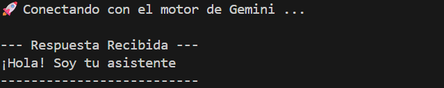

# Gemini API con Python — Ejemplos de Prompting


Colección de scripts Python que demuestran cómo conectarse a la **API de Google Gemini** y aplicar distintas técnicas de prompting: desde una conexión básica hasta traducción de lenguaje natural a SQL usando few-shot prompting.

---

## Tabla de contenidos

- [¿Qué hace este proyecto?](#qué-hace-este-proyecto)
- [Estructura del proyecto](#estructura-del-proyecto)
- [Requisitos previos](#requisitos-previos)
- [Instalación paso a paso](#instalación-paso-a-paso)
- [Configuración de la API Key](#configuración-de-la-api-key)
- [Cómo ejecutar cada script](#cómo-ejecutar-cada-script)
- [Evidencia de ejecución](#evidencia-de-ejecución)

---

## ¿Qué hace este proyecto?

Este repositorio explora el uso de la **Google Gemini API** con el SDK oficial de Python (`google-genai`). Cada script aborda un caso de uso diferente:

| Script | Técnica | Descripción |
|---|---|---|
| `app_gemini.py` | Conexión básica | Presenta al modelo como asistente de un curso de IA |
| `app_gemini_copy.py` | Resumen + métricas | Resume una conversación y calcula tokens y costo |
| `app_text_5.py` | Zero-shot / One-shot / Few-shot | Clasifica sentimientos en texto |
| `app_text_6.py` | Few-shot avanzado | Traduce lenguaje natural a sentencias SQL |
| `import requests.py` | Diagnóstico | Verifica el entorno virtual y la conexión a internet |

---

## Estructura del proyecto

```
gemini-api/
├── app_gemini.py          # Conexión básica a Gemini con reintentos
├── app_gemini_copy.py     # Resumen de conversación + conteo de tokens
├── app_text_5.py          # Clasificación de sentimientos (prompting shots)
├── app_text_6.py          # Natural language → SQL (few-shot)
├── import requests.py     # Script de verificación del entorno
├── requirements.txt       # Dependencias del proyecto
├── image.png              # Evidencia de ejecución
└── README.md
```

---

## Requisitos previos

- Python **3.10 o superior**
- Una **API Key de Google Gemini** (gratuita en [Google AI Studio](https://aistudio.google.com/app/apikey))
- Conexión a internet

---

## Instalación paso a paso

### 1. Clona el repositorio

```bash
git clone https://github.com/tu-usuario/gemini-api.git
cd gemini-api
```

### 2. Crea y activa el entorno virtual

**Windows:**
```bash
python -m venv venv
venv\Scripts\activate
```

**macOS / Linux:**
```bash
python3 -m venv venv
source venv/bin/activate
```

> Sabrás que está activo porque el prompt de tu terminal mostrará `(venv)` al inicio.

### 3. Instala las dependencias

```bash
pip install -r requirements.txt
```

### 4. Verifica que el entorno esté listo

```bash
python "import requests.py"
```

Deberías ver algo como:
```
--- Verificación de Entorno Virtual ---
✅ Estado: Entorno Virtual ACTIVO.
📍 Ruta de Python: .../venv/Scripts/python.exe
🌐 Conexión a internet: OK (Google es alcanzable).
```

---

## Configuración de la API Key

Crea un archivo `.env` en la raíz del proyecto con el siguiente contenido:

```env
GEMINI_API_KEY=tu_clave_api_aqui
```

> **Importante:** Nunca subas el archivo `.env` a GitHub. Agrega `.env` a tu `.gitignore`.

Para obtener tu API Key gratuita:
1. Ve a [Google AI Studio](https://aistudio.google.com/app/apikey)
2. Haz clic en **"Create API key"**
3. Copia la clave y pégala en tu archivo `.env`

---

## Cómo ejecutar cada script

### `app_gemini.py` — Conexión básica

Envía un prompt al modelo y recibe una presentación como asistente de IA. Incluye lógica de reintentos automáticos ante errores de cuota (429).

```bash
python app_gemini.py
```

**Salida esperada:**
```
🚀 Conectando con el motor de Gemini ...

--- Respuesta Recibida ---
¡Hola! Soy tu asistente de IA...
--------------------------
```

---

### `app_gemini_copy.py` — Resumen de conversación + métricas de tokens

Toma una conversación simulada de soporte al cliente y la resume en 4 puntos clave. Al finalizar imprime los tokens consumidos y el costo estimado en USD.

```bash
python app_gemini_copy.py
```

**Salida esperada:**
```
🚀 Conectando con el motor de Gemini ...

--- Respuesta Recibida ---
1. El cliente reportó un retraso en su pedido #12345...
...
--------------------------
Tokens consumidos en este intento: 312
Costo de los tokens consumidos en este intento: $0.000936
```
## Evidencia de ejecución

La siguiente captura muestra la ejecución exitosa de `app_gemini.py` conectándose al motor de Gemini y recibiendo respuesta:



---

## Conceptos cubiertos

- Conexión a la **Google Gemini API** con el SDK oficial `google-genai`
- Manejo de errores y **reintentos exponenciales** ante límites de cuota
- Cálculo de **tokens consumidos y costo** por consulta
- **Zero-shot prompting**: sin ejemplos, solo instrucción directa
- **One-shot prompting**: un ejemplo para guiar el formato de respuesta
- **Few-shot prompting**: múltiples ejemplos para patrones complejos
- Gestión segura de credenciales con **variables de entorno** (`.env`)
- Verificación del entorno virtual con Python

---

## Licencia

Este proyecto está bajo la licencia **MIT**. Puedes usarlo, modificarlo y distribuirlo libremente.
